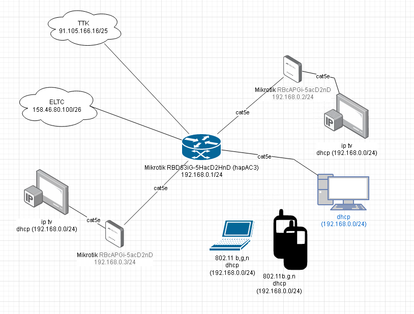

## Домашнее задание к занятию "3.8 Компьютерные сети, лекция 3"

***
## Подключитесь к публичному маршрутизатору в интернет. Найдите маршрут к вашему публичному IP
```
telnet route-views.routeviews.org
Username: rviews
show ip route x.x.x.x/32
show bgp x.x.x.x/32
```
###
```shell
route-views>show ip route 158.46.80.100
Routing entry for 158.46.0.0/17
  Known via "bgp 6447", distance 20, metric 0
  Tag 2497, type external
  Last update from 202.232.0.2 1d06h ago
  Routing Descriptor Blocks:
  * 202.232.0.2, from 202.232.0.2, 1d06h ago
      Route metric is 0, traffic share count is 1
      AS Hops 3
      Route tag 2497
      MPLS label: none
route-views>show bgp 158.46.80.100
BGP routing table entry for 158.46.0.0/17, version 2688284440
Paths: (20 available, best #17, table default)
  Not advertised to any peer
  Refresh Epoch 1
  7018 1299 39927, (aggregated by 39927 95.181.0.78)
    12.0.1.63 from 12.0.1.63 (12.0.1.63)
      Origin IGP, localpref 100, valid, external, atomic-aggregate
      Community: 7018:5000 7018:37232
      path 7FE18453B5A8 RPKI State not found
      rx pathid: 0, tx pathid: 0
  Refresh Epoch 1
  3267 31133 39927, (aggregated by 39927 95.181.0.77)
    194.85.40.15 from 194.85.40.15 (185.141.126.1)
      Origin IGP, metric 0, localpref 100, valid, external, atomic-aggregate
      path 7FE1374EB090 RPKI State not found
      rx pathid: 0, tx pathid: 0
  Refresh Epoch 1
  3333 31133 39927, (aggregated by 39927 95.181.0.77)
    193.0.0.56 from 193.0.0.56 (193.0.0.56)
      Origin IGP, localpref 100, valid, external, atomic-aggregate
      path 7FE07F6C8758 RPKI State not found
      rx pathid: 0, tx pathid: 0
  Refresh Epoch 1
  20912 3257 28917 28917 28917 28917 28917 28917 28917 48858 48858 48858 48858 39927, (aggregated by 39927 95.181.0.77)
    212.66.96.126 from 212.66.96.126 (212.66.96.126)
      Origin IGP, localpref 100, valid, external, atomic-aggregate
      Community: 3257:4000 3257:8092 3257:50001 3257:50111 3257:54800 3257:54801 20912:65004
      path 7FE033C3A530 RPKI State not found
      rx pathid: 0, tx pathid: 0
  Refresh Epoch 1
  6939 20764 39927, (aggregated by 39927 95.181.0.78)
    64.71.137.241 from 64.71.137.241 (216.218.253.53)
      Origin IGP, localpref 100, valid, external, atomic-aggregate
      path 7FE0B16C4210 RPKI State not found
      rx pathid: 0, tx pathid: 0
  Refresh Epoch 1
  8283 1299 39927, (aggregated by 39927 95.181.0.78)
    94.142.247.3 from 94.142.247.3 (94.142.247.3)
      Origin IGP, metric 0, localpref 100, valid, external, atomic-aggregate
      Community: 1299:30000 8283:1 8283:101
      unknown transitive attribute: flag 0xE0 type 0x20 length 0x18
        value 0000 205B 0000 0000 0000 0001 0000 205B
              0000 0005 0000 0001 
      path 7FE14E798018 RPKI State not found
      rx pathid: 0, tx pathid: 0
  Refresh Epoch 1
  3257 28917 28917 28917 28917 28917 28917 28917 48858 48858 48858 48858 39927, (aggregated by 39927 95.181.0.77)
    89.149.178.10 from 89.149.178.10 (213.200.83.26)
      Origin IGP, metric 10, localpref 100, valid, external, atomic-aggregate
      Community: 3257:4000 3257:8092 3257:50001 3257:50111 3257:54800 3257:54801
      path 7FDFFFC53E78 RPKI State not found
      rx pathid: 0, tx pathid: 0
  Refresh Epoch 1
  3561 3910 3356 20764 39927, (aggregated by 39927 95.181.0.78)
    206.24.210.80 from 206.24.210.80 (206.24.210.80)
      Origin IGP, localpref 100, valid, external, atomic-aggregate
      path 7FE0AAF84720 RPKI State not found
      rx pathid: 0, tx pathid: 0
  Refresh Epoch 1
  49788 12552 31133 39927, (aggregated by 39927 95.181.0.77)
    91.218.184.60 from 91.218.184.60 (91.218.184.60)
      Origin IGP, localpref 100, valid, external, atomic-aggregate
      Community: 12552:12000 12552:12100 12552:12101 12552:22000
      Extended Community: 0x43:100:1
      path 7FE1482BA8A8 RPKI State not found
      rx pathid: 0, tx pathid: 0
  Refresh Epoch 1
  19214 174 31133 39927, (aggregated by 39927 95.181.0.77)
    208.74.64.40 from 208.74.64.40 (208.74.64.40)
      Origin IGP, localpref 100, valid, external, atomic-aggregate
      Community: 174:21101 174:22005
      path 7FE0B46F1990 RPKI State not found
      rx pathid: 0, tx pathid: 0
  Refresh Epoch 1
  3549 3356 20764 39927, (aggregated by 39927 95.181.0.78)
    208.51.134.254 from 208.51.134.254 (67.16.168.191)
      Origin IGP, metric 0, localpref 100, valid, external, atomic-aggregate
      Community: 3356:2 3356:22 3356:100 3356:123 3356:501 3356:903 3356:2065 3549:2581 3549:30840 20764:1122 20764:1151 20764:1161 20764:1251 20764:1410 20764:1432 20764:3002 20764:3011 20764:3021 20764:3136 25478:1000 25478:4019 25478:5999
      path 7FE03EAE1308 RPKI State not found
      rx pathid: 0, tx pathid: 0
  Refresh Epoch 1
  4901 6079 31133 39927, (aggregated by 39927 95.181.0.77)
    162.250.137.254 from 162.250.137.254 (162.250.137.254)
      Origin IGP, localpref 100, valid, external, atomic-aggregate
      Community: 65000:10100 65000:10300 65000:10400
      path 7FE055DE5E88 RPKI State not found
      rx pathid: 0, tx pathid: 0
  Refresh Epoch 1
  101 3491 20485 20485 39927 39927, (aggregated by 39927 95.181.0.77)
    209.124.176.223 from 209.124.176.223 (209.124.176.223)
      Origin IGP, localpref 100, valid, external, atomic-aggregate
      Community: 101:20300 101:22100 3491:300 3491:311 3491:9001 3491:9080 3491:9081 3491:9087 3491:62210 3491:62220 20485:10042
      path 7FE13B61EFA8 RPKI State not found
      rx pathid: 0, tx pathid: 0
  Refresh Epoch 1
  3356 20764 39927, (aggregated by 39927 95.181.0.78)
    4.68.4.46 from 4.68.4.46 (4.69.184.201)
      Origin IGP, metric 0, localpref 100, valid, external, atomic-aggregate
      Community: 3356:2 3356:22 3356:100 3356:123 3356:501 3356:903 3356:2065 20764:1122 20764:1151 20764:1161 20764:1251 20764:1410 20764:1432 20764:3002 20764:3011 20764:3021 20764:3136 25478:1000 25478:4019 25478:5999 65000:714 65000:6185 65000:16509 65000:16625 65000:20940
      path 7FE0BE94EC80 RPKI State not found
      rx pathid: 0, tx pathid: 0
  Refresh Epoch 1
  3303 31133 39927, (aggregated by 39927 95.181.0.77)
    217.192.89.50 from 217.192.89.50 (138.187.128.158)
      Origin IGP, localpref 100, valid, external, atomic-aggregate
      Community: 0:15169 3303:1004 3303:1006 3303:1030 3303:3056 31133:26149
      path 7FE11AAD37E0 RPKI State not found
      rx pathid: 0, tx pathid: 0
  Refresh Epoch 1
  57866 28917 48858 48858 48858 48858 39927, (aggregated by 39927 95.181.0.77)
    37.139.139.17 from 37.139.139.17 (37.139.139.17)
      Origin IGP, metric 0, localpref 100, valid, external, atomic-aggregate
      Community: 0:6939 0:16276 0:31500 0:49981 28917:2000 28917:2299 28917:5106 28917:5110 28917:5111 28917:5180 28917:5220 28917:5300 48858:50042 57866:200 65102:41441 65103:1 65104:31
      Extended Community: RT:48858:50
      unknown transitive attribute: flag 0xE0 type 0x20 length 0x30
        value 0000 E20A 0000 0065 0000 00C8 0000 E20A
              0000 0066 0000 A1E1 0000 E20A 0000 0067
              0000 0001 0000 E20A 0000 0068 0000 001F
              
      path 7FE090D53060 RPKI State not found
      rx pathid: 0, tx pathid: 0
  Refresh Epoch 2
  2497 12389 39927, (aggregated by 39927 95.181.0.77)
    202.232.0.2 from 202.232.0.2 (58.138.96.254)
      Origin IGP, localpref 100, valid, external, atomic-aggregate, best
      path 7FE0DF4976B8 RPKI State not found
      rx pathid: 0, tx pathid: 0x0
  Refresh Epoch 1
  20130 6939 20764 39927, (aggregated by 39927 95.181.0.78)
    140.192.8.16 from 140.192.8.16 (140.192.8.16)
      Origin IGP, localpref 100, valid, external, atomic-aggregate
      path 7FE154DD7D38 RPKI State not found
      rx pathid: 0, tx pathid: 0
  Refresh Epoch 1
  852 31133 39927, (aggregated by 39927 95.181.0.77)
    154.11.12.212 from 154.11.12.212 (96.1.209.43)
      Origin IGP, metric 0, localpref 100, valid, external, atomic-aggregate
      path 7FE177664168 RPKI State not found
      rx pathid: 0, tx pathid: 0
  Refresh Epoch 1
  1351 6939 20764 39927, (aggregated by 39927 95.181.0.78)
    132.198.255.253 from 132.198.255.253 (132.198.255.253)
      Origin IGP, localpref 100, valid, external, atomic-aggregate
      path 7FE115DC4F70 RPKI State not found
      rx pathid: 0, tx pathid: 0
```

***
## Создайте dummy0 интерфейс в Ubuntu. Добавьте несколько статических маршрутов. Проверьте таблицу маршрутизации.
###
```shell
dmitriy@dmitriy-lin:~$ sudo nano /etc/netplan/02-dymmy.yaml
network:
  version: 2
  renderer: networkd
  bridges:
    dummy0:
      dhcp4: no
      dhcp6: no
      accept-ra: no
      interfaces: [ ]
      addresses:
        - 192.168.151.55/32

dmitriy@dmitriy-lin:~$ sudo netplan apply

dmitriy@dmitriy-lin:~$ ifconfig -a | grep dummy
dummy0: flags=4163<UP,BROADCAST,RUNNING,MULTICAST>  mtu 1500
dmitriy@dmitriy-lin:~$ ip a | grep dummy
5: dummy0: <BROADCAST,MULTICAST,UP,LOWER_UP> mtu 1500 qdisc noqueue state UNKNOWN group default qlen 1000
    inet 192.168.151.55/32 scope global dummy0

dmitriy@dmitriy-lin:~$ netstat -r
Таблица маршутизации ядра протокола IP
Destination Gateway Genmask Flags MSS Window irtt Iface
default         _gateway        0.0.0.0         UG        0 0          0 ens18
link-local      0.0.0.0         255.255.0.0     U         0 0          0 ens18
192.168.10.0    0.0.0.0         255.255.255.0   U         0 0          0 ens18
dmitriy@dmitriy-lin:~$ sudo ip addr add 192.168.1.150/24 dev dummy0
dmitriy@dmitriy-lin:~$ sudo ip addr add 192.168.99.0/24 dev dummy0
dmitriy@dmitriy-lin:~$ netstat -r
Таблица маршутизации ядра протокола IP
Destination Gateway Genmask Flags MSS Window irtt Iface
default         _gateway        0.0.0.0         UG        0 0          0 ens18
link-local      0.0.0.0         255.255.0.0     U         0 0          0 ens18
192.168.1.0     0.0.0.0         255.255.255.0   U         0 0          0 dummy0
192.168.10.0    0.0.0.0         255.255.255.0   U         0 0          0 ens18
192.168.99.0    0.0.0.0         255.255.255.0   U         0 0          0 dummy0
dmitriy@dmitriy-lin:~$ sudo ip addr del 192.168.1.150/24 dev dummy0
dmitriy@dmitriy-lin:~$ netstat -r
Таблица маршутизации ядра протокола IP
Destination Gateway Genmask Flags MSS Window irtt Iface
default         _gateway        0.0.0.0         UG        0 0          0 ens18
link-local      0.0.0.0         255.255.0.0     U         0 0          0 ens18
192.168.10.0    0.0.0.0         255.255.255.0   U         0 0          0 ens18
192.168.99.0    0.0.0.0         255.255.255.0   U         0 0          0 dummy0
dmitriy@dmitriy-lin:~$ sudo ip addr del 192.168.99.0/24 dev dummy0
dmitriy@dmitriy-lin:~$ netstat -r
Таблица маршутизации ядра протокола IP
Destination Gateway Genmask Flags MSS Window irtt Iface
default         _gateway        0.0.0.0         UG        0 0          0 ens18
link-local      0.0.0.0         255.255.0.0     U         0 0          0 ens18
192.168.10.0    0.0.0.0         255.255.255.0   U         0 0          0 ens18
```

***
## Проверьте открытые TCP порты в Ubuntu, какие протоколы и приложения используют эти порты? Приведите несколько примеров.
###
```shel
dmitriy@dmitriy-lin:~$ sudo ss -lpnt
State     Recv-Q    Send-Q       Local Address:Port        Peer Address:Port    Process                                                                         
LISTEN    0         4096               0.0.0.0:56175            0.0.0.0:*        users:(("rpc.mountd",pid=816,fd=17))                                           
LISTEN    0         4096               0.0.0.0:38191            0.0.0.0:*        users:(("rpc.mountd",pid=816,fd=9))                                            
LISTEN    0         4096               0.0.0.0:111              0.0.0.0:*        users:(("rpcbind",pid=617,fd=4),("systemd",pid=1,fd=393))                      
LISTEN    0         4096         127.0.0.53%lo:53               0.0.0.0:*        users:(("systemd-resolve",pid=618,fd=13))                                      
LISTEN    0         128                0.0.0.0:22               0.0.0.0:*        users:(("sshd",pid=787,fd=3))                                                  
LISTEN    0         5                127.0.0.1:631              0.0.0.0:*        users:(("cupsd",pid=32526,fd=7))                                               
LISTEN    0         4096               0.0.0.0:49623            0.0.0.0:*        users:(("rpc.mountd",pid=816,fd=13))                                           
LISTEN    0         64                 0.0.0.0:37693            0.0.0.0:*                                                                                       
LISTEN    0         64                 0.0.0.0:2049             0.0.0.0:*                                                                                       
LISTEN    0         4096                  [::]:45775               [::]:*        users:(("rpc.mountd",pid=816,fd=15))                                           
LISTEN    0         4096                  [::]:111                 [::]:*        users:(("rpcbind",pid=617,fd=6),("systemd",pid=1,fd=395))                      
LISTEN    0         511                      *:80                     *:*        users:(("apache2",pid=32535,fd=4),("apache2",pid=32534,fd=4),("apache2",pid=8296,fd=4))
LISTEN    0         64                    [::]:46707               [::]:*                                                                                       
LISTEN    0         2                    [::1]:3350                [::]:*        users:(("xrdp-sesman",pid=796,fd=7))                                           
LISTEN    0         128                   [::]:22                  [::]:*        users:(("sshd",pid=787,fd=4))                                                  
LISTEN    0         5                    [::1]:631                 [::]:*        users:(("cupsd",pid=32526,fd=6))                                               
LISTEN    0         4096                  [::]:51959               [::]:*        users:(("rpc.mountd",pid=816,fd=11))                                           
LISTEN    0         4096                  [::]:36827               [::]:*        users:(("rpc.mountd",pid=816,fd=19))                                           
LISTEN    0         2                        *:3389                   *:*        users:(("xrdp",pid=876,fd=11))                                                 
LISTEN    0         64                    [::]:2049                [::]:*                                                                                       
```
    80 - Apache
    53 - внутренняя служба для работы dns
    22 - ssh доступ
    3389 - RDP доступ в ВМ ubuntu с windows (через XRDP)

***
## Проверьте используемые UDP сокеты в Ubuntu, какие протоколы и приложения используют эти порты?
###
```shell
dmitriy@dmitriy-lin:~$ sudo ss -lpnu
State     Recv-Q    Send-Q       Local Address:Port        Peer Address:Port    Process                                                                         
UNCONN    0         0                  0.0.0.0:48889            0.0.0.0:*        users:(("rpc.mountd",pid=816,fd=8))                                            
UNCONN    0         0            127.0.0.53%lo:53               0.0.0.0:*        users:(("systemd-resolve",pid=618,fd=12))                                      
UNCONN    0         0                  0.0.0.0:111              0.0.0.0:*        users:(("rpcbind",pid=617,fd=5),("systemd",pid=1,fd=394))                      
UNCONN    0         0                  0.0.0.0:45466            0.0.0.0:*                                                                                       
UNCONN    0         0                  0.0.0.0:33336            0.0.0.0:*        users:(("rpc.mountd",pid=816,fd=12))                                           
UNCONN    0         0                  0.0.0.0:631              0.0.0.0:*        users:(("cups-browsed",pid=32528,fd=7))                                        
UNCONN    0         0              224.0.0.251:5353             0.0.0.0:*        users:(("chrome",pid=48914,fd=156))                                            
UNCONN    0         0                  0.0.0.0:55029            0.0.0.0:*        users:(("rpc.mountd",pid=816,fd=16))                                           
UNCONN    0         0                  0.0.0.0:2049             0.0.0.0:*                                                                                       
UNCONN    0         0                     [::]:111                 [::]:*        users:(("rpcbind",pid=617,fd=7),("systemd",pid=1,fd=396))                      
UNCONN    0         0                     [::]:45339               [::]:*        users:(("rpc.mountd",pid=816,fd=18))                                           
UNCONN    0         0                     [::]:37619               [::]:*        users:(("rpc.mountd",pid=816,fd=14))                                           
UNCONN    0         0                     [::]:38401               [::]:*                                                                                       
UNCONN    0         0                     [::]:50944               [::]:*        users:(("rpc.mountd",pid=816,fd=10))                                           
UNCONN    0         0                     [::]:2049                [::]:*                                   
```
    53 - внутренняя служба для работы dns
    111 - rpcbind демон, сопоставляющий универсальные адреса и номера программ RPC
    631 - cups-browsed сервер печати

***
## Используя diagrams.net, создайте L3 диаграмму вашей домашней сети или любой другой сети, с которой вы работали.
###
