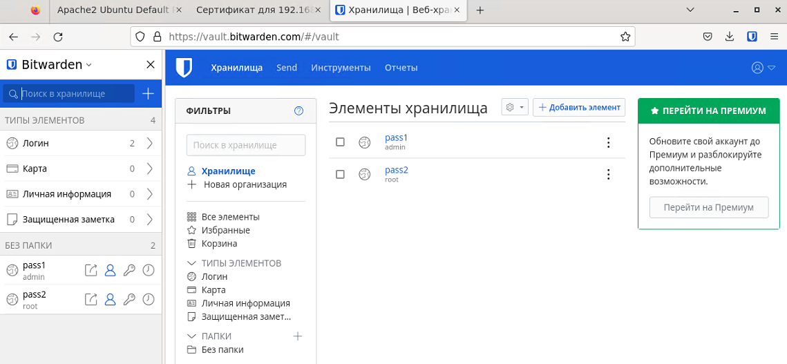
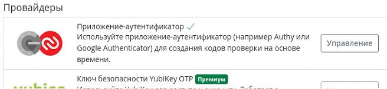
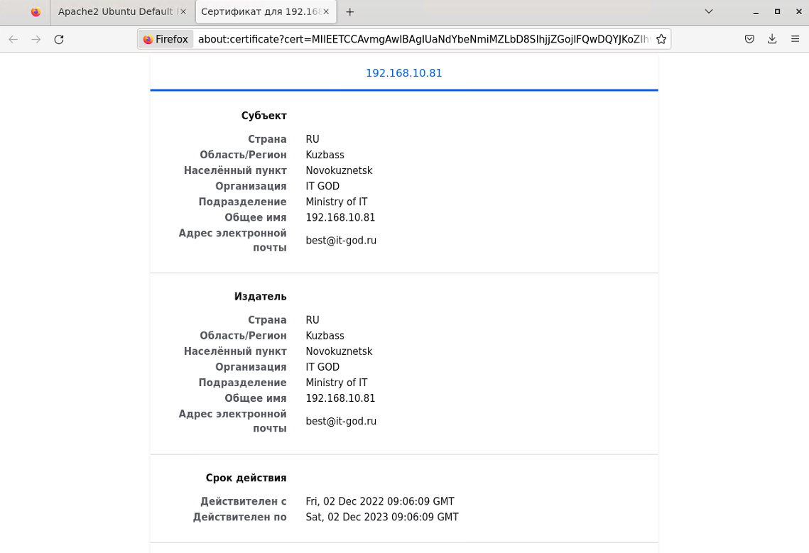

## Домашнее задание к занятию "Элементы безопасности информационных систем"

***
## Установите Bitwarden плагин для браузера. Зарегестрируйтесь и сохраните несколько паролей.
###


***
## Установите Google authenticator на мобильный телефон. Настройте вход в Bitwarden акаунт через Google authenticator OTP.
###
Скрин экрана на мобильном не делается. Б - безопасность.



***
## Установите apache2, сгенерируйте самоподписанный сертификат, настройте тестовый сайт для работы по HTTPS.
###
Данную часть делал ранее в рамках изучения Apache, соответственно даты ключа будут на момент его генерации.
```shell
dmitriy@dmitriy-lin:~$ sudo openssl req -x509 -nodes -days 365 -newkey rsa:2048 -keyout /etc/ssl/private/apache-selfsigned.key -out /etc/ssl/certs/apache-selfsigned.crt
Generating a RSA private key
....+++++
..............................................................................................+++++
writing new private key to '/etc/ssl/private/apache-selfsigned.key'
-----
You are about to be asked to enter information that will be incorporated
into your certificate request.
What you are about to enter is what is called a Distinguished Name or a DN.
There are quite a few fields but you can leave some blank
For some fields there will be a default value,
If you enter '.', the field will be left blank.
-----
Country Name (2 letter code) [AU]:RU
State or Province Name (full name) [Some-State]:Kuzbass
Locality Name (eg, city) []:Novokuznetsk
Organization Name (eg, company) [Internet Widgits Pty Ltd]:IT GOD
Organizational Unit Name (eg, section) []:Ministry of IT
Common Name (e.g. server FQDN or YOUR name) []:192.168.10.81
Email Address []:best@it-god.ru
```
Весь процесс описывать не буду ключевые моменты:
```shell
dmitriy@dmitriy-lin:~$ cat /etc/apache2/sites-available/default-ssl.conf
<IfModule mod_ssl.c>
        <VirtualHost _default_:443>
                ServerAdmin best@it-god.ru
                ServerName 192.168.10.81

                DocumentRoot /var/www/html

                ErrorLog ${APACHE_LOG_DIR}/error.log
                CustomLog ${APACHE_LOG_DIR}/access.log combined

                SSLEngine on

                SSLCertificateFile      /etc/ssl/certs/apache-selfsigned.crt
                SSLCertificateKeyFile /etc/ssl/private/apache-selfsigned.key

                <FilesMatch "\.(cgi|shtml|phtml|php)$">
                                SSLOptions +StdEnvVars
                </FilesMatch>
                <Directory /usr/lib/cgi-bin>
                                SSLOptions +StdEnvVars
                </Directory>

        </VirtualHost>
</IfModule>
```
Все что необходимо перезапускаем / активируем, если вдруг не активировано.
В итоге получим:



***
## Проверьте на TLS уязвимости произвольный сайт в интернете (кроме сайтов МВД, ФСБ, МинОбр, НацБанк, РосКосмос, РосАтом, РосНАНО и любых госкомпаний, объектов КИИ, ВПК ... и тому подобное).
###
```shell
dmitriy@dmitriy-lin:~$ mkdir testssl
dmitriy@dmitriy-lin:~$ cd testssl/
dmitriy@dmitriy-lin:~/testssl$ git clone --depth 1 https://github.com/drwetter/testssl.sh.git
Клонирование в «testssl.sh»...
remote: Enumerating objects: 104, done.
remote: Counting objects: 100% (104/104), done.
remote: Compressing objects: 100% (97/97), done.
remote: Total 104 (delta 15), reused 35 (delta 6), pack-reused 0
Получение объектов: 100% (104/104), 8.74 МиБ | 137.00 КиБ/с, готово.
Определение изменений: 100% (15/15), готово.
dmitriy@dmitriy-lin:~/testssl$ ls -l
итого 4
drwxrwxr-x 9 dmitriy dmitriy 4096 фев  13 14:51 testssl.sh
dmitriy@dmitriy-lin:~/testssl$ cd testssl.sh/
dmitriy@dmitriy-lin:~/testssl/testssl.sh$ ls -l
итого 1328
drwxrwxr-x 2 dmitriy dmitriy    4096 фев  13 14:51 bin
-rw-rw-r-- 1 dmitriy dmitriy   19110 фев  13 14:51 CHANGELOG.md
-rw-rw-r-- 1 dmitriy dmitriy    5792 фев  13 14:51 Coding_Convention.md
-rw-rw-r-- 1 dmitriy dmitriy    1286 фев  13 14:51 CONTRIBUTING.md
-rw-rw-r-- 1 dmitriy dmitriy    4242 фев  13 14:51 CREDITS.md
drwxrwxr-x 2 dmitriy dmitriy    4096 фев  13 14:51 doc
-rw-rw-r-- 1 dmitriy dmitriy     623 фев  13 14:51 Dockerfile
-rw-rw-r-- 1 dmitriy dmitriy     684 фев  13 14:51 Dockerfile.git
-rw-rw-r-- 1 dmitriy dmitriy    1485 фев  13 14:51 Dockerfile.md
drwxrwxr-x 2 dmitriy dmitriy    4096 фев  13 14:51 etc
-rw-rw-r-- 1 dmitriy dmitriy   18092 фев  13 14:51 LICENSE
-rw-rw-r-- 1 dmitriy dmitriy   62258 фев  13 14:51 openssl-iana.mapping.html
-rw-rw-r-- 1 dmitriy dmitriy    7229 фев  13 14:51 Readme.md
drwxrwxr-x 3 dmitriy dmitriy    4096 фев  13 14:51 t
-rwxrwxr-x 1 dmitriy dmitriy 1189570 фев  13 14:51 testssl.sh
drwxrwxr-x 2 dmitriy dmitriy    4096 фев  13 14:51 utils
dmitriy@dmitriy-lin:~/testssl/testssl.sh$ ./testssl.sh netology.ru

###########################################################
    testssl.sh       3.2rc2 from https://testssl.sh/dev/
    (198bb09 2022-11-28 17:09:04)

      This program is free software. Distribution and
             modification under GPLv2 permitted.
      USAGE w/o ANY WARRANTY. USE IT AT YOUR OWN RISK!

       Please file bugs @ https://testssl.sh/bugs/

###########################################################

 Using "OpenSSL 1.0.2-bad (1.0.2k-dev)" [~183 ciphers]
 on denis-lin:./bin/openssl.Linux.x86_64
 (built: "Sep  1 14:03:44 2022", platform: "linux-x86_64")


Testing all IPv4 addresses (port 443): 104.22.41.171 172.67.21.207 104.22.40.171
--------------------------------------------------------------------------------------------------------------------------------------------
 Start 2023-02-13 14:54:32        -->> 104.22.41.171:443 (netology.ru) <<--

 Further IP addresses:   104.22.40.171 172.67.21.207 2606:4700:10::6816:28ab 2606:4700:10::ac43:15cf 2606:4700:10::6816:29ab
 rDNS (104.22.41.171):   --
 Service detected:       HTTP


 Testing protocols via sockets except NPN+ALPN

 SSLv2      not offered (OK)
 SSLv3      not offered (OK)
 TLS 1      offered (deprecated)
 TLS 1.1    offered (deprecated)
 TLS 1.2    offered (OK)
 TLS 1.3    offered (OK): final
 NPN/SPDY   h2, http/1.1 (advertised)
 ALPN/HTTP2 h2, http/1.1 (offered)

 Testing cipher categories

 NULL ciphers (no encryption)                      not offered (OK)
 Anonymous NULL Ciphers (no authentication)        not offered (OK)
 Export ciphers (w/o ADH+NULL)                     not offered (OK)
 LOW: 64 Bit + DES, RC[2,4], MD5 (w/o export)      not offered (OK)
 Triple DES Ciphers / IDEA                         offered
 Obsoleted CBC ciphers (AES, ARIA etc.)            offered
 Strong encryption (AEAD ciphers) with no FS       offered (OK)
 Forward Secrecy strong encryption (AEAD ciphers)  offered (OK)


 Testing server's cipher preferences

Hexcode  Cipher Suite Name (OpenSSL)       KeyExch.   Encryption  Bits     Cipher Suite Name (IANA/RFC)
-----------------------------------------------------------------------------------------------------------------------------
SSLv2
 -
SSLv3
 -
TLSv1 (server order)
 xc013   ECDHE-RSA-AES128-SHA              ECDH 256   AES         128      TLS_ECDHE_RSA_WITH_AES_128_CBC_SHA
 x2f     AES128-SHA                        RSA        AES         128      TLS_RSA_WITH_AES_128_CBC_SHA
 xc014   ECDHE-RSA-AES256-SHA              ECDH 256   AES         256      TLS_ECDHE_RSA_WITH_AES_256_CBC_SHA
 x35     AES256-SHA                        RSA        AES         256      TLS_RSA_WITH_AES_256_CBC_SHA
 x0a     DES-CBC3-SHA                      RSA        3DES        168      TLS_RSA_WITH_3DES_EDE_CBC_SHA
TLSv1.1 (server order)
 xc013   ECDHE-RSA-AES128-SHA              ECDH 256   AES         128      TLS_ECDHE_RSA_WITH_AES_128_CBC_SHA
 x2f     AES128-SHA                        RSA        AES         128      TLS_RSA_WITH_AES_128_CBC_SHA
 xc014   ECDHE-RSA-AES256-SHA              ECDH 256   AES         256      TLS_ECDHE_RSA_WITH_AES_256_CBC_SHA
 x35     AES256-SHA                        RSA        AES         256      TLS_RSA_WITH_AES_256_CBC_SHA
TLSv1.2 (server order -- server prioritizes ChaCha ciphers when preferred by clients)
 xc02b   ECDHE-ECDSA-AES128-GCM-SHA256     ECDH 253   AESGCM      128      TLS_ECDHE_ECDSA_WITH_AES_128_GCM_SHA256
 xcc14   ECDHE-ECDSA-CHACHA20-POLY1305-OLD ECDH 253   ChaCha20    256      TLS_ECDHE_ECDSA_WITH_CHACHA20_POLY1305_SHA256_OLD
 xcca9   ECDHE-ECDSA-CHACHA20-POLY1305     ECDH 253   ChaCha20    256      TLS_ECDHE_ECDSA_WITH_CHACHA20_POLY1305_SHA256
 xc009   ECDHE-ECDSA-AES128-SHA            ECDH 253   AES         128      TLS_ECDHE_ECDSA_WITH_AES_128_CBC_SHA
 xc02c   ECDHE-ECDSA-AES256-GCM-SHA384     ECDH 253   AESGCM      256      TLS_ECDHE_ECDSA_WITH_AES_256_GCM_SHA384
 xc00a   ECDHE-ECDSA-AES256-SHA            ECDH 253   AES         256      TLS_ECDHE_ECDSA_WITH_AES_256_CBC_SHA
 xc023   ECDHE-ECDSA-AES128-SHA256         ECDH 253   AES         128      TLS_ECDHE_ECDSA_WITH_AES_128_CBC_SHA256
 xc024   ECDHE-ECDSA-AES256-SHA384         ECDH 253   AES         256      TLS_ECDHE_ECDSA_WITH_AES_256_CBC_SHA384
 xc02f   ECDHE-RSA-AES128-GCM-SHA256       ECDH 253   AESGCM      128      TLS_ECDHE_RSA_WITH_AES_128_GCM_SHA256
 xcc13   ECDHE-RSA-CHACHA20-POLY1305-OLD   ECDH 253   ChaCha20    256      TLS_ECDHE_RSA_WITH_CHACHA20_POLY1305_SHA256_OLD
 xcca8   ECDHE-RSA-CHACHA20-POLY1305       ECDH 253   ChaCha20    256      TLS_ECDHE_RSA_WITH_CHACHA20_POLY1305_SHA256
 xc013   ECDHE-RSA-AES128-SHA              ECDH 253   AES         128      TLS_ECDHE_RSA_WITH_AES_128_CBC_SHA
 x9c     AES128-GCM-SHA256                 RSA        AESGCM      128      TLS_RSA_WITH_AES_128_GCM_SHA256
 x2f     AES128-SHA                        RSA        AES         128      TLS_RSA_WITH_AES_128_CBC_SHA
 xc030   ECDHE-RSA-AES256-GCM-SHA384       ECDH 253   AESGCM      256      TLS_ECDHE_RSA_WITH_AES_256_GCM_SHA384
 xc014   ECDHE-RSA-AES256-SHA              ECDH 253   AES         256      TLS_ECDHE_RSA_WITH_AES_256_CBC_SHA
 x9d     AES256-GCM-SHA384                 RSA        AESGCM      256      TLS_RSA_WITH_AES_256_GCM_SHA384
 x35     AES256-SHA                        RSA        AES         256      TLS_RSA_WITH_AES_256_CBC_SHA
 xc027   ECDHE-RSA-AES128-SHA256           ECDH 253   AES         128      TLS_ECDHE_RSA_WITH_AES_128_CBC_SHA256
 x3c     AES128-SHA256                     RSA        AES         128      TLS_RSA_WITH_AES_128_CBC_SHA256
 xc028   ECDHE-RSA-AES256-SHA384           ECDH 253   AES         256      TLS_ECDHE_RSA_WITH_AES_256_CBC_SHA384
 x3d     AES256-SHA256                     RSA        AES         256      TLS_RSA_WITH_AES_256_CBC_SHA256
TLSv1.3 (no server order, thus listed by strength)
 x1302   TLS_AES_256_GCM_SHA384            ECDH 253   AESGCM      256      TLS_AES_256_GCM_SHA384
 x1303   TLS_CHACHA20_POLY1305_SHA256      ECDH 253   ChaCha20    256      TLS_CHACHA20_POLY1305_SHA256
 x1301   TLS_AES_128_GCM_SHA256            ECDH 253   AESGCM      128      TLS_AES_128_GCM_SHA256

 Has server cipher order?     yes (OK) -- only for < TLS 1.3


 Testing robust forward secrecy (FS) -- omitting Null Authentication/Encryption, 3DES, RC4
...
```
Весь вывод очень большой, первые строки для понимания что работает.

***
## Установите на Ubuntu ssh сервер, сгенерируйте новый приватный ключ. Скопируйте свой публичный ключ на другой сервер. Подключитесь к серверу по SSH-ключу.
###
```shell
dmitriy@dmitriy-lin:~$ ssh-keygen
Generating public/private rsa key pair.
Enter file in which to save the key (/home/dmitriy/.ssh/id_rsa):
Enter passphrase (empty for no passphrase):
Enter same passphrase again:
Your identification has been saved in /home/dmitriy/.ssh/id_rsa
Your public key has been saved in /home/dmitriy/.ssh/id_rsa.pub
The key fingerprint is:
SHA256:kuJq5nunlMUqC1PnGyJk02o83hg6BCPNUc0r/6KkcNU dmitriy@dmitriy-lin
The key's randomart image is:
+---[RSA 3072]----+
|   ..o           |
|  .   o          |
| o .   .         |
|+ + .o..         |
|o=..+oE S        |
|+oo= =..         |
|**+ O  .         |
|=*BO.oo .        |
|.B*+++ .         |
+----[SHA256]-----+
dmitriy@dmitriy-lin:~$ ssh-copy-id root@192.168.100.202
/usr/bin/ssh-copy-id: INFO: Source of key(s) to be installed: "/home/dmitriy/.ssh/id_rsa.pub"
The authenticity of host '192.168.100.202 (192.168.100.202)' can't be established.
ECDSA key fingerprint is SHA256:3cHHCrcCuLwx6uTo46wjoaCTlJXn8sk7fhh5VgJBGlc.
Are you sure you want to continue connecting (yes/no/[fingerprint])? yes
/usr/bin/ssh-copy-id: INFO: attempting to log in with the new key(s), to filter out any that are already installed
/usr/bin/ssh-copy-id: INFO: 1 key(s) remain to be installed -- if you are prompted now it is to install the new keys
root@192.168.100.202's password:

Number of key(s) added: 1

Now try logging into the machine, with:   "ssh 'root@192.168.100.202'"
and check to make sure that only the key(s) you wanted were added.

dmitriy@dmitriy-lin:~$ ssh root@192.168.100.202
Linux shara 5.3.10-1-pve #1 SMP PVE 5.3.10-1 (Thu, 14 Nov 2019 10:43:13 +0100) x86_64

The programs included with the Debian GNU/Linux system are free software;
the exact distribution terms for each program are described in the
individual files in /usr/share/doc/*/copyright.

Debian GNU/Linux comes with ABSOLUTELY NO WARRANTY, to the extent
permitted by applicable law.
Last login: Thu Nov 10 12:59:11 2022
root@shara:~#
```

***
## Переименуйте файлы ключей из задания 5. Настройте файл конфигурации SSH клиента, так чтобы вход на удаленный сервер осуществлялся по имени сервера.
###
```shell
dmitriy@dmitriy-lin:~$ cd ~/.ssh/
dmitriy@dmitriy-lin:~/.ssh$ mv id_rsa id_rsa_dmitriy
dmitriy@dmitriy-lin:~/.ssh$ touch config
dmitriy@dmitriy-lin::~/.ssh$ chmod 600 config
dmitriy@dmitriy-lin:~/.ssh$ nano config
dmitriy@dmitriy-lin:~/.ssh$ cat config
Host shara
        HostName 192.168.100.202
        IdentityFile ~/.ssh/id_rsa_dmitriy
        User root
dmitriy@dmitriy-lin:~/.ssh$ ssh shara
Linux shara 5.3.10-1-pve #1 SMP PVE 5.3.10-1 (Thu, 14 Nov 2019 10:43:13 +0100) x86_64

The programs included with the Debian GNU/Linux system are free software;
the exact distribution terms for each program are described in the
individual files in /usr/share/doc/*/copyright.

Debian GNU/Linux comes with ABSOLUTELY NO WARRANTY, to the extent
permitted by applicable law.
Last login: Tue Feb  14 15:13:07 2022 from 192.168.10.81
root@shara:~#
```

***
## Соберите дамп трафика утилитой tcpdump в формате pcap, 100 пакетов. Откройте файл pcap в Wireshark.
###
```shell
dmitriy@dmitriy-lin:~$ sudo tcpdump -i ens18 -c 100 -w tcpdump14022023.pcap
[sudo] пароль для dmitriy: 
tcpdump: listening on ens18, link-type EN10MB (Ethernet), capture size 262144 bytes
100 packets captured
113 packets received by filter
0 packets dropped by kernel
```
